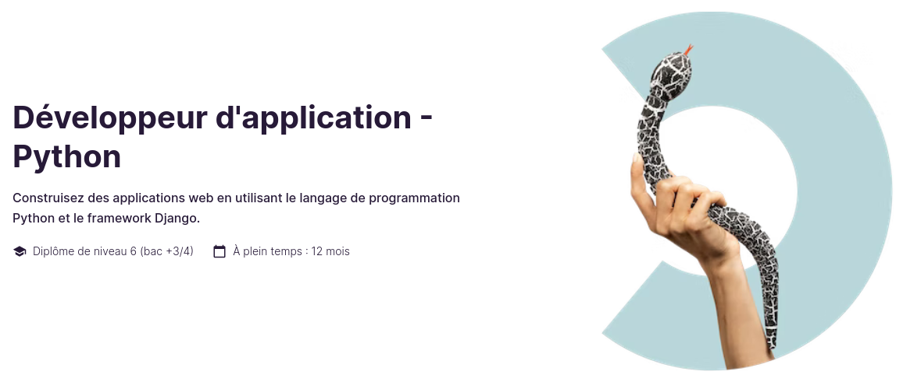

# [OpenClassRoom](https://openclassrooms.com/) - Parcours développeur Python

## Projet 4 - Développer un programme logiciel en Python

### Description projet
Application dédiée à un club d'échec fictif. Elle doit permettre la gestion de clubs, joueurs, tournois.
Le programme fonctionne sous Windows, Mac ou Linux.

### Exigences
- [x] Suivre le modèle de conception modèle-vue-contrôleur.
- [x] Application doit être un programme autonome et hors ligne.
- [x] Programme doit être écrit en Python et lancé depuis la console.
- [x] Programme doit fonctionner sous Windows, Mac ou Linux.
- [x] Etat du programme doit être sauvegardé à tout moment entre 2 actions utilisateur.
- [x] Le programme doit charger toutes ses données à partir de fichiers JSON et pouvoir restaurer son état entre les exécutions.
- [x] Mise en forme et nettoyage du code avec flake8 ; option de longueur de ligne maximale fixée à 119
- [x] Rapport flake8-html à générer dans un répertoire appelé "flake8_rapport", qui n'affiche aucune erreur et valide que le code est conforme aux directives PEP 8.

NB: Les rapports peuvent être en texte brut, à condition qu'ils soient bien formatés et faciles à lire. Modèles HTML acceptés.

---

## Comment utiliser le projet ?
1. Clone the repository

      `git clone git@github.com:memphis-tools/oc_projet4_chess_tournament.git`

      `cd oc_projet4_chess_tournament`

2. Setup a virtualenv

      `python -m venv env`

      `source env/bin/activate`

      `pip install -U pip`

      `pip install -r requirements.txt`

3. Run code

      `python main.py`

## Comment vérifier la syntaxe PEP8 du projet ?
1. Create flake8-html report

      `python -m flake8 --format=html --htmldir=flake8_rapport/`

## Comment fonctionne l'application ?
Elle est prévue en mode "terminal /console" par défaut.

Initialement le projet sera vide. Au moins 1 club devra être crée pour enregistrer 1 à n joueurs.

Un club inactif (statut "inactive" ou "archived") implique qu'aucuns de ses joueurs ne seront inscrits à la création d'un tournoi.

Un club actif, peut avoir des joueurs actifs ou non.

La création d'un tournoi consiste à créer un évènement avec l'ensemble des joueurs de tous les clubs au statut "active". Il est possible de créer des tournois en parallèle.

Une fois le tournoi crée, il faut parcourir de nouveau le menu pour mettre à jour les rounds et scores: 3. Tournoi > 4. MODIFIER > 2. ACTUALISER TOURS/MATCHS

Une fois les scores d'un round saisis, on doit valider la saisie. Au 27/03/2023 il n'y a pas de fonctionnalité implémentée qui remettrait les scores d'un round à zéro en vue de les saisir de nouveau. En d'autres termes, si on ne valide pas la saisie des scores d'un round, ça empeche de passer à la création  du round suivant et donc des matches.

La demande de suppression d'un joueur connu d'un tournoi le positionne au statut "archived".

La demande de suppression d'un club ayant des joueurs connus d'un tounoi le positionne au statut "archived".

La demande de suppression d'un tournoi consiste à retirer aux joueurs les points acquis à chaques matches.

Plusieurs éléments peuvent être modifiés manuellement, aussi quels qu'ils soient, il faut éviter de déroger aux règles ci-dessus ou manipuler les données en connaissances des liens existants.
